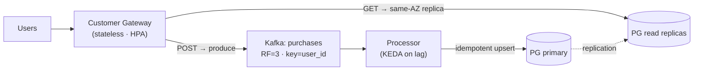

# Purchase Events Platform — Design Submission

An event-driven system that ingests user **purchase events**, persists them, and serves
per-user purchase history — designed to run on **AWS EKS** with reliability, scalability,
and operational maturity.

## What this repository is (and isn't)

This is a **technical design deliverable**, not a running implementation.

The take-home is scoped at ~3 days of build work. I made a deliberate, communicated
decision to invest in the **design and decision-making** — the part every evaluation
criterion actually turns on (system design, Kubernetes decisions, resilience/scalability
reasoning, observability, and clarity of trade-offs) — and to **time-box it to ~2 hours**
rather than produce a rushed full implementation. The design is written to be
implementation-ready: specific operators, manifests, metrics, and pipeline stages are named
throughout. Rationale is in [DESIGN §1](docs/DESIGN.md#1-scope--approach).

## Start here

| Document | What's in it |
|---|---|
| **[docs/DESIGN.md](docs/DESIGN.md)** | The full technical design — architecture, K8s, cross-AZ cost, failure-domain math, scaling, observability, CI/CD, runbook. |
| [docs/adr/0001](docs/adr/0001-messaging-kafka-vs-sqs.md) | Messaging: **Kafka vs SQS** (incl. the honest cross-AZ cost analysis). |
| [docs/adr/0002](docs/adr/0002-database-selfhosted-vs-managed.md) | Database: **self-hosted Postgres vs managed RDS**. |
| [docs/adr/0003](docs/adr/0003-cross-az-cost-minimization.md) | **Cross-AZ cost minimization** strategy. |

## Architecture at a glance

- **Write path (async):** Client → Gateway → Kafka → Processor → Postgres. Returns `202` on
  durable enqueue; the stream absorbs bursts.
- **Read path (sync):** Client → Gateway → same-AZ Postgres read replica.

## Headline decisions

- **Kafka (Strimzi) over SQS** — for ordering, replay, and lag-based autoscaling; chosen
  *despite* SQS being cheaper on cross-AZ transfer, with that cost then minimized via
  rack-aware fetch + topology-aware routing.
- **Survive 1 AZ + 1 node** — 3-AZ spread, RF=3 (one replica/AZ, `min.insync.replicas=2`),
  6 Kafka brokers / 4 Postgres instances sized to retain HA *through* the failure, PDBs +
  topology spread constraints.
- **Autoscaling on the right signal** — gateway on CPU/RPS (HPA), processor on **consumer
  lag** (KEDA), nodes via Karpenter.
- **At-least-once + idempotent upserts** — simple, correct, no exactly-once machinery.

## How a reviewer would run it (intended)

The implementation isn't included, but the [intended runbook](docs/DESIGN.md#14-build--deploy--test-intended-runbook)
and [proposed repo layout](docs/DESIGN.md#15-proposed-repository-structure) specify exactly
how it would build, deploy (kind locally / EKS in cloud), and verify — including a
`kubectl drain` resilience check and a k6 burst load test.
