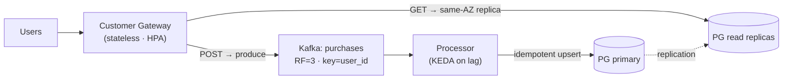

# Purchase Events Platform — Design Submission

An event-driven system that ingests user **purchase events**, persists them, and serves
per-user purchase history — designed to run on **AWS EKS** with reliability, scalability,
and operational maturity.

This is a **technical design deliverable** — architecture and decision-making, written to be
implementation-ready (specific operators, manifests, metrics, and pipeline stages are named
throughout).

## Start here

| Document | What's in it |
|---|---|
| **[docs/DESIGN.md](docs/DESIGN.md)** | The full technical design — architecture, K8s, cross-AZ cost, failure-domain math, scaling, observability, CI/CD, runbook. |
| [docs/adr/0001](docs/adr/0001-cross-az-cost-minimization.md) | **Cross-AZ cost minimization** strategy. |

## Architecture at a glance

- **Write path (async):** Client → Gateway → Kafka → Processor → Postgres. Returns `202` on
  durable enqueue; the stream absorbs bursts.
- **Read path (sync):** Client → Gateway → same-AZ Postgres read replica.

## Headline decisions

- **Kafka (Strimzi)** — chosen for per-user ordering, replay, lag-based autoscaling, and
  running natively on K8s; cross-AZ replication cost is then minimized via rack-aware fetch +
  topology-aware routing.
- **PostgreSQL (CloudNativePG)** — operator-managed on K8s; relational fit for the per-user,
  time-ordered access pattern with ACID guarantees.
- **Survive 1 AZ + 1 node** — 3-AZ spread, RF=3 (one replica/AZ, `min.insync.replicas=2`),
  6 Kafka brokers, Postgres sized with an explicit availability-vs-durability fallback, PDBs
  + topology spread constraints.
- **Autoscaling on the right signal** — gateway on CPU/RPS (HPA), processor on **consumer
  lag** (KEDA), nodes via Karpenter.
- **At-least-once + idempotent upserts** — simple, correct, no exactly-once machinery.

## How a reviewer would run it (intended)

The implementation isn't included, but the [intended runbook](docs/DESIGN.md#13-build--deploy--test-intended-runbook)
and [proposed repo layout](docs/DESIGN.md#14-proposed-repository-structure) specify exactly
how it would build, deploy (kind locally / EKS in cloud), and verify — including a
`kubectl drain` resilience check and a k6 burst load test.
