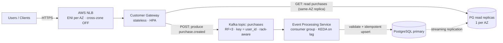

# Purchase Events Platform — Technical Design

> **Status:** Design proposal · **Author:** _(candidate)_ · **Last updated:** 2026-06-15
> **Target platform:** AWS EKS, 3 Availability Zones, single region.

---

## Table of Contents

1. [Requirements](#1-requirements)
2. [Architecture Overview](#2-architecture-overview)
3. [Component Design](#3-component-design)
4. [API, Event & Data Contracts](#4-api-event--data-contracts)
5. [Delivery Semantics & Consistency](#5-delivery-semantics--consistency)
6. [Kubernetes Design](#6-kubernetes-design)
7. [Cross-AZ Cost Minimization](#7-cross-az-cost-minimization)
8. [Failure-Domain Design (survive 1 AZ + 1 node)](#8-failure-domain-design-survive-1-az--1-node)
9. [Scalability](#9-scalability)
10. [Observability](#10-observability)
11. [Security](#11-security)
12. [CI/CD — GitHub Actions (bonus)](#12-cicd--github-actions-bonus)
13. [Build / Deploy / Test (intended runbook)](#13-build--deploy--test-intended-runbook)
14. [Proposed Repository Structure](#14-proposed-repository-structure)
15. [Trade-offs Summary](#15-trade-offs-summary)
16. [Decision Log](#16-decision-log)
17. [Risks & Future Work](#17-risks--future-work)

---

## 1. Requirements

### 1.1 Functional

| # | Requirement |
|---|---|
| F1 | Accept incoming purchase requests from users (over HTTP/REST — see §1.3). |
| F2 | Publish each purchase as an event to an asynchronous event stream. |
| F3 | Consume, validate, and persist purchase events. |
| F4 | Return all purchases for a given user. |
| F5 | Persist at minimum: user identifier, username, price, timestamp. |

### 1.2 Non-functional

| # | Requirement |
|---|---|
| N1 | Entire system runs on Kubernetes. |
| N2 | Minimize cross-AZ data-transfer cost between components. |
| N3 | Remain operational through **1 AZ failure _and_ 1 node failure** (concurrent). |
| N4 | Components expose health signals for K8s availability decisions. |
| N5 | Workloads declare explicit resource requests/limits. |
| N6 | Capacity auto-adjusts with demand; reasoning documented. |
| N7 | Observability sufficient to debug failures and understand throughput. |

### 1.3 Assumptions

- **Transport is HTTP/REST.** The assignment says "provides an endpoint" but not which
  protocol; HTTP/REST is the conventional choice.
- Purchases are **write-heavy and append-only** (no in-place edits of a purchase).
- **Per-user ordering matters, global ordering does not.**
  - *Per-user ordering* = events for the **same** `user_id` are processed in the order they
    were submitted (so a user's purchase history is coherent).
  - *Global ordering* = a single total order across **all** users' events. We do **not**
    need this — events from different users may be processed in parallel / interleaved.
    This is what lets us shard work across Kafka partitions and scale consumers
    horizontally (see §3.2).
- A purchase event is **small** (< 1 KB).
- **Eventual consistency on reads is acceptable** — the write path is asynchronous by
  design. See [§5](#5-delivery-semantics--consistency).
- Workload is **spiky** (sales/marketing bursts), which justifies an event buffer and
  autoscaling rather than synchronous writes.

---

## 2. Architecture Overview



**Load balancing (the client entry point).** A **single** internet-facing AWS **NLB**
(Network Load Balancer), provisioned by the **AWS Load Balancer Controller** running in the
cluster, is the entry point for client traffic. It has a network interface (ENI) **in each
AZ's subnet** for AZ redundancy. **Cross-zone load balancing is left OFF** (the NLB
default): each AZ's LB node forwards only to gateway pods in the **same AZ**, keeping the
client→gateway hop AZ-local (cost, §7) — safe because topology spread guarantees healthy
gateway pods in every AZ.

We deploy a **single region**: the assignment requires multi-AZ resilience, not
multi-region, so one regional NLB is sufficient. Multi-region (a second cluster + global
routing) would only be added for disaster recovery or geo-latency — out of scope, noted in
§17.

A **Layer-7 ingress** (an NGINX ingress controller or an ALB) isn't needed for a single API;
we'd add one only if we later fronted several services behind one entrypoint.

**Write path (async, F1–F3, F5):** `Client → Gateway → Kafka (purchases) → Processor →
Postgres`. The gateway returns `202 Accepted` as soon as the event is durably written to
Kafka. The stream absorbs bursts and decouples ingest rate from DB write rate.

**Read path (sync, F4):** `Client → Gateway → Postgres read replica`. The gateway connects
to the **read-only Service that the CloudNativePG operator provisions** (it targets the
replicas, not the primary), and **Topology Aware Routing** (§7) steers the connection to the
**same-AZ** replica — keeping reads off the primary and AZ-local.

**Why event-driven** (vs. the gateway writing straight to the DB): it buffers spiky
purchase traffic, decouples ingest from persistence, lets the two sides scale
independently, and gives us a replayable log for reprocessing and debugging.

---

## 3. Component Design

### 3.1 Customer Gateway

- **Responsibility:** terminate client HTTP, validate request shape, attach an idempotency
  key, **produce** to Kafka (write path), and **read** from Postgres (read path). No
  business logic, no DB writes.
- **Statelessness:** fully stateless → trivially horizontally scalable and a clean HPA
  target.
- **Idempotent producer.** The gateway's Kafka **producer client** (the Kafka SDK inside
  the gateway process) is configured with:
  - `enable.idempotence=true` — the producer tags each record with a sequence number so the
    broker **deduplicates retries**; a network retry can't create a duplicate event.
  - `acks=all` — the producer waits until **all in-sync replicas** have the record before
    treating the write as successful (durability; pairs with `min.insync.replicas=2`, §3.2).
- **Implementation note:** Go or Python/FastAPI. The client `Idempotency-Key` header maps to
  the event's `event_id`, so a client retry resolves to the same event.

### 3.2 Event Stream — Apache Kafka (via Strimzi)

**Decision: self-hosted Apache Kafka on EKS, managed by the Strimzi operator (KRaft mode,
no ZooKeeper).** Kafka is chosen for the requirements it answers:

- **Per-user ordering** (the §1.3 ordering assumption) via partitioning on `user_id` (Kafka
  guarantees order *within* a partition; same key → same partition → same user's events stay
  ordered).
- **Replay & durability** (supports F3 + debuggability) — the retained log lets us reprocess
  after a bug or rebuild the read store; a plain queue deletes on consume.
- **Consumer-lag autoscaling** (N6) — partition lag is a precise, first-class scaling signal
  for the processor (KEDA, §9).
- **Runs on Kubernetes** (N1) — Strimzi makes Kafka a native, operator-managed K8s workload.

**Why Kafka over other K8s-native options.** NATS JetStream is lighter to run, but its
stream/consumer model is a weaker fit for partition-keyed per-user ordering and it lacks
Kafka's mature lag-based autoscaling (KEDA) and replay ecosystem. RabbitMQ is queue-oriented
(strong routing, but no ordered, replayable partitioned log). Kafka's partitioned log is the
best match for ordered-per-user + replay + lag-autoscaling, and Strimzi keeps it
operationally manageable on K8s.

**Topic `purchases`:** `replication factor = 3`, `min.insync.replicas = 2`, `acks=all`,
rack-aware replica placement (`broker.rack` = AZ), retention 7 days (replay window).

**Why partitions = 12 (and how to scale them).** A partition is the unit of consumer
parallelism: the **maximum number of actively-consuming pods in a consumer group equals the
partition count** (extra pods sit idle). 12 is a deliberate starting point — it is **divisible
by 3** (even spread across AZs) and by common consumer counts (2, 3, 4, 6, 12), giving
headroom to scale the processor up to 12 pods without repartitioning, while staying small
enough to keep per-broker overhead low. *(Every partition costs the broker resources: it
holds per-partition leader/replica state and an in-memory index in memory, open file handles
and log-segment files on disk, and a replication fetcher per follower. Tens of thousands of
partitions per broker inflate memory and file descriptors and slow leader election during
failover — so we keep the count modest.)*

Scaling partitions later is possible but **sensitive**, so we capacity-plan up front:
- You can **increase** partitions online (`kafka-topics --alter --partitions N`) but **never
  decrease**.
- Increasing changes the key→partition mapping (`hash(key) % partitionCount`), so a given
  `user_id` may map to a **different** partition afterward. New events for that user go to
  the new partition while older events remain in the old one → the **per-user ordering
  guarantee breaks across the change boundary**, and briefly two consumers can handle the
  same user.
- Therefore: over-provision partitions modestly at creation (what we do here). If a large
  increase is ever truly needed, **migrate to a new topic** instead of reshuffling a live
  one:
  1. Create `purchases.v2` with the higher partition count.
  2. Switch producers to `v2` (optionally dual-publish briefly).
  3. Let consumers drain `v1` to completion, then move the consumer group to `v2`.
  4. Decommission `v1` after retention expires.

  **Cost:** transient operational complexity and a cutover window in which ordering must be
  protected — drain `v1` for a given user before `v2` takes over for that user, so their
  events aren't processed out of order across the boundary. It's a planned migration, not a
  hot operation, which is exactly why we provision enough partitions up front.

### 3.3 Event Processing Service

- **Responsibility:** consume `purchases`, validate the payload, and **idempotently
  upsert** into Postgres keyed on `event_id`.
- **Consumer group** — one group; partitions distribute across pods, so scaling the
  deployment scales parallel consumption (up to `partitions = 12`).
- **At-least-once + idempotent writes** — Kafka can redeliver on failure; the
  `INSERT ... ON CONFLICT (event_id) DO NOTHING` makes reprocessing safe (§5).
- **Offset commit after DB commit** — commit Kafka offsets only after the row is durable, so
  a crash mid-process re-delivers rather than silently loses data.

### 3.4 Database — PostgreSQL on Kubernetes (CloudNativePG)

Two design questions matter here: **what data model**, and **which engine**.

**Why a relational database (vs. key-value / document).** The stored entity is simple and
uniform, but the *access patterns* favor relational:
- F4 ("all purchases for a user, newest-first, paginated") plus very likely future needs
  (aggregations, reporting, time-range queries, "spend per user/period") are exactly what
  SQL + secondary indexes do well.
- Purchases are financial-adjacent, so we want **ACID** (Atomicity, Consistency, Isolation,
  Durability) **transactions**, strong consistency, and `NUMERIC` money handling.
- A key-value/document store (e.g., DynamoDB with partition key `user_id`) would serve the
  literal "by user_id" lookup and scales writes more easily, but trades away three things we
  value:
  - **Ad-hoc querying** — running arbitrary filters/aggregations we didn't plan for up front
    (e.g., "total spend per user last month"); SQL does this natively, whereas a KV store
    forces you to precompute or full-scan.
  - **Joins** — answering a query by combining rows from multiple tables in one statement
    (e.g., purchases × users × products). KV stores have no joins, so you denormalize the
    data or issue many separate lookups in application code.
  - **Transactional richness** — updating several rows atomically and with isolation
    (multi-statement ACID transactions), rather than only per-key writes.

  A KV store becomes attractive only if **write throughput** outgrows a single primary —
  captured as future work (§17, sharding).

**Why PostgreSQL (vs. MySQL).** Both are solid; Postgres is preferred for:
- **Mature K8s operators** (CloudNativePG, Zalando) with robust automated failover, backups
  (PITR via Barman), and per-instance placement control — central to our HA design (§8).
- **Feature fit:** stronger SQL standard compliance, partial/expression indexes, excellent
  `NUMERIC`, and `JSONB` if we later persist a flexible payload.
- **Quorum-based synchronous replication** controls we rely on for the failure-domain
  design (§8.3).
- MySQL (Group Replication / InnoDB Cluster) is a reasonable alternative; the deciding
  factor is operator maturity + feature preference, not a hard requirement.

**Operator: CloudNativePG.** Runs Postgres as a native K8s workload (N1), automates HA
failover and backups, and lets us **place one read replica per AZ** for the cross-AZ-cheap
read path (§7). Topology and sizing for surviving an AZ+node loss are in [§8.3](#83-postgresql).

---

## 4. API, Event & Data Contracts

### 4.1 REST API (Customer Gateway)

```
POST /v1/purchases
  Headers: Idempotency-Key: <uuid>        # optional; gateway generates if absent
  Body:    { "user_id": "u-123", "username": "alice", "price": 49.90, "currency": "USD" }
  202:     { "event_id": "<uuid>", "status": "accepted" }   # accepted = enqueued, not yet queryable

GET /v1/users/{user_id}/purchases?limit=50&cursor=<opaque>
  200: { "items": [ { "event_id", "user_id", "username", "price", "currency",
                      "purchased_at" } ], "next_cursor": "<opaque|null>" }

GET /healthz      # liveness  — process up
GET /readyz       # readiness — Kafka producer + DB reachable
GET /metrics      # Prometheus exposition
```

### 4.2 Event schema (`purchases` topic)

Key = `user_id` (guarantees per-user ordering). Value (versioned JSON for this design):

```json
{
  "event_id": "uuid",
  "event_type": "purchase.created",
  "schema_version": 1,
  "user_id": "u-123",
  "username": "alice",
  "price": 49.90,
  "currency": "USD",
  "occurred_at": "2026-06-15T10:00:00Z"
}
```

> **Avro / Schema Registry (production upgrade, not used here).** *Avro* is a compact
> **binary** serialization format that carries an explicit schema. A *Schema Registry*
> (e.g., Confluent or Apicurio) is a service that stores and **versions** those schemas;
> producers/consumers reference a schema by ID and the registry **enforces compatibility**
> (e.g., a backward-incompatible change is rejected before it can break consumers). Versus
> hand-rolled JSON it gives smaller payloads and safe schema evolution. We keep JSON +
> `schema_version` for simplicity; the registry is listed in future work (§17).

### 4.3 Database schema

```sql
CREATE TABLE purchases (
  event_id     UUID PRIMARY KEY,          -- idempotency key (dedup on reprocess)
  user_id      TEXT          NOT NULL,
  username     TEXT          NOT NULL,
  price        NUMERIC(12,2) NOT NULL,
  currency     CHAR(3)       NOT NULL DEFAULT 'USD',
  purchased_at TIMESTAMPTZ   NOT NULL,    -- business time (occurred_at)
  created_at   TIMESTAMPTZ   NOT NULL DEFAULT now()  -- ingest time
);
CREATE INDEX idx_purchases_user_time ON purchases (user_id, purchased_at DESC);
```

`event_id` PK gives free idempotency; the composite index serves the F4 read pattern
(latest-first, paginated, per user).

---

## 5. Delivery Semantics & Consistency

- **Delivery: at-least-once.** Kafka + offset-after-commit can redeliver on failure. We make
  this safe with **idempotent upserts** (`ON CONFLICT (event_id) DO NOTHING`).
- **Why not exactly-once.** True end-to-end exactly-once across Kafka and an external
  database needs significant extra machinery and yields **the same end state** that
  idempotent upserts already give us — so we deliberately skip it.
- **Producer idempotence** (`enable.idempotence=true`, see §3.1) prevents duplicate events
  from producer retries.
- **Consistency model: read-your-writes is _not_ guaranteed.** Because persistence is
  asynchronous, a `GET` immediately after a `POST` may not show the purchase yet. Trade-off
  accepted for burst absorption and decoupling. Mitigations:
  - `POST` returns `202` + `event_id` so clients know the write is *accepted*, not yet
    queryable.
  - End-to-end lag is typically sub-second under normal load and is monitored/alerted (§10).
  - If strict read-your-writes were required, we'd add an `event_id` status endpoint or an
    optional synchronous confirm path (§17).

---

## 6. Kubernetes Design

### 6.1 Cluster topology

- **EKS**, one region, **3 AZs**. Nodes span all 3 AZs.
- Separate node pools: a **stateless app** pool (gateway, processor — burstable,
  spot-friendly) and a **stateful** pool (Kafka, Postgres — on-demand, EBS gp3, tainted so
  only stateful pods land there).
- Each AZ has its own subnet; the NLB has an ENI/target in each (§2).

### 6.2 Health signals (N4)

Each workload exposes **three distinct probes** — conflating them is a common cause of
cascading restarts:

| Probe | What it checks | Effect on failure |
|---|---|---|
| **startup** | has the container finished booting? | see note below |
| **liveness** (`/healthz`) | is the process responsive / event loop alive? | **restart** the container |
| **readiness** (`/readyz`) | are dependencies reachable (Kafka producer / assigned partitions + DB)? | **remove from Service endpoints** (stop sending traffic) but don't restart |

> **Startup probe:** a probe that runs **only during initial startup**. While it is still
> failing, the liveness and readiness probes are **disabled**.
> Once it succeeds once, Kubernetes hands over to liveness/readiness. Its job is to protect
> **slow-starting** containers (e.g., a consumer joining a group, JVM warmup) from being
> killed by an aggressive liveness probe before they've finished booting.

Readiness gating a dependency lets a pod **stay running but stop receiving traffic** during
a transient Kafka/DB blip instead of crash-looping.

### 6.3 Resource management (N5)

Every container sets **requests and limits**. The figures below are **starting points to be
validated by load test** (k6), then refined — they are not guesses left vague:

| Workload | CPU request | CPU limit | Mem request | Mem limit | QoS |
|---|---|---|---|---|---|
| Gateway | 100m | *(none — avoid throttling)* | 256Mi | 256Mi | Burstable |
| Processor | 250m | *(none)* | 512Mi | 512Mi | Burstable |
| Kafka broker | 1 | 1 | 4Gi | 4Gi | Guaranteed |
| Postgres | 1 | 1 | 4Gi | 4Gi | Guaranteed |

Guidance:
- **CPU request = observed steady-state usage** under representative load (≈ p50–p75 of
  measured CPU), *not* an aspirational low (causes overcommit + noisy neighbors) and *not*
  peak. Over-sized requests hurt **bin-packing** — the scheduler reserves a node's capacity
  by each pod's *requests*, so inflated requests fit fewer pods per node and force more
  (costlier) nodes even when actual usage is low.
- **Omit CPU limits** on latency-sensitive app pods to avoid CFS throttling; if a limit is
  required by policy, set it generously.
- **Memory request == limit** on each container so stateful pods land in the **Guaranteed**
  QoS class and are last to be evicted under memory pressure.
- **Refine with VPA in recommend mode.** The **VPA (Vertical Pod Autoscaler)** is a
  controller you install; in `updateMode: Off` ("recommend mode") it **only emits
  recommended** requests/limits from observed usage — it does **not** restart pods to apply
  them. A human reviews the recommendation and updates the manifest. We keep it in recommend
  mode so it never fights the HPA (which scales replica *count*) by simultaneously resizing
  pods.

### 6.4 Scheduling, spread & disruption

- **`topologySpreadConstraints`** — a field in the **Pod spec** that instructs the scheduler
  to distribute matching pods evenly across a topology domain. We set `maxSkew: 1` (the pod
  count in any two domains differs by at most 1) over **both**
  `topology.kubernetes.io/zone` (spread across AZs) **and** `kubernetes.io/hostname` (spread
  across nodes). This even spread is what makes N3 achievable.
- **PodDisruptionBudgets (PDBs)** on all multi-replica workloads (`minAvailable` sized so an
  AZ drain can't break quorum) to protect against **voluntary** disruptions (node upgrades).
- **Anti-affinity** so no two Kafka brokers (or two Postgres instances) share a node.

---

## 7. Cross-AZ Cost Minimization

This is the requirement most designs hand-wave, so it gets its own section. Full record in
[ADR-0001](adr/0001-cross-az-cost-minimization.md).

**The cost mechanic.** On AWS, in-region **cross-AZ EC2↔EC2** traffic costs **$0.01/GB in
each direction** (~$0.02/GB round trip); same-AZ traffic is free. So "minimize cross-AZ" =
"keep each hop inside one AZ wherever correctness allows."

We apply locality at four layers and **explicitly accept** the two hops that must cross AZs
for correctness.

**1. Edge (client → gateway):** the NLB has **cross-zone load balancing OFF** (§2), so each
AZ's LB node forwards only to same-AZ gateway pods. No cross-AZ hop at the edge.

**2. Synchronous service-to-service hops → Topology Aware Routing.** Set
`Service.spec.trafficDistribution: PreferClose` (K8s ≥1.31; older clusters use the
`service.kubernetes.io/topology-mode: Auto` annotation). EndpointSlice hints then steer
callers to **same-AZ endpoints** when healthy ones exist — gateway→read-replica,
processor→Kafka, processor→Postgres.

**3. Read path locality → one Postgres read replica per AZ.** The gateway's F4 reads (the
highest-volume query traffic) resolve to the **local-AZ replica** via topology-aware
routing — same-AZ and off the primary.

**4. Kafka consumer reads → rack-aware fetch (KIP-392).** Set `broker.rack` = AZ and enable
`RackAwareReplicaSelector`. Consumers then fetch from a **same-AZ follower replica** instead
of always hitting the (possibly remote) partition leader — eliminating cross-AZ **consume**
traffic, typically the dominant variable cost. *(KIP-392 — "Kafka Improvement Proposal" 392,
"Allow consumers to fetch from the closest replica" — is the Kafka feature that makes reading
from a same-rack/same-AZ follower possible; before it, consumers could only read from the
leader.)*

**Accepted (irreducible) cross-AZ hops:**
- **Kafka replication (RF=3, one replica per AZ):** mandatory to survive an AZ loss (N3);
  crosses AZs by definition. A durability cost we accept.
- **Producer→leader & processor→primary writes:** must reach the single leader/primary, so
  ~2/3 of pods write cross-AZ. This stays bounded because a purchase is **written once** but
  **read many times** — every consumer poll plus every user `GET` re-reads data — so
  read/consume bytes generally dominate write bytes. That asymmetry is why we invest in
  making reads same-AZ (layers 3–4) and simply accept the smaller write hop.

**Net:** cross-AZ spend is reduced to the durability-required minimum while all high-volume
read/consume traffic stays same-AZ. We confirm this holds under real traffic by monitoring
cross-AZ bytes (VPC flow logs / Cost & Usage Report).

---

## 8. Failure-Domain Design (survive 1 AZ + 1 node)

N3 is the sharpest constraint: stay **operational** through an **AZ loss _and_ a node loss
at the same time**. Worst case in a 3-AZ cluster = lose all of one AZ's capacity **plus** one
node in a *surviving* AZ.

### 8.1 Stateless services (gateway, processor)

Spread across 3 AZs (§6.4). Size replicas so that after losing ⌈N/3⌉ (one AZ) **+ 1** (a
node), survivors still serve peak.

> Example: peak needs **4** healthy replicas. Run **N = 9** (3 per AZ). Lose 1 AZ (−3) and 1
> node (−1) → **5 healthy ≥ 4**. ✅ Autoscaler `minReplicas` is floored at this safe number.

### 8.2 Kafka

| Concern | Design | AZ+node outcome |
|---|---|---|
| Brokers | **6 brokers, 2 per AZ**; partitions RF=3 with **one replica per AZ** (rack-aware) | Lose 1 AZ (−2 brokers) → each partition keeps 2 in-sync replicas in the other AZs; `min.insync.replicas=2` still writable. Lose 1 more node → that AZ still has its 2nd broker holding the replica → still ≥2 ISR. ✅ |
| Durability | `acks=all`, `min.insync.replicas=2` | A write is acked only once it's on ≥2 AZs → an AZ loss can't lose acked data. |
| Control plane (KRaft) | dedicated controller quorum | **Subtle point:** a 3-controller quorum tolerates only **1** failure, so a concurrent AZ+node loss can break it if the lost AZ happens to hold 2 of the 3 controllers. To strictly survive AZ+node, run **5 controllers** spread across AZs so the metadata quorum keeps a majority through the worst case, and validate placement. |

> **ISR = In-Sync Replicas:** the set of replicas (leader + followers) fully caught up with
> the leader. With `acks=all` + `min.insync.replicas=2`, a produce succeeds only while ≥2
> replicas are in the ISR. If a replica falls behind it is removed from the ISR ("ISR
> shrink", an alert signal — §10).

### 8.3 PostgreSQL

This is where the naive design breaks, and it's worth being precise: **synchronous commit
cannot be honored if no standby survives.**

- **Placement & sizing.** Instances spread across 3 AZs via topology spread. With *N*
  instances, one AZ holds ⌈N/3⌉, so the worst-case AZ+node loss removes ⌈N/3⌉ + 1 instances.
  Survivors = `N − ⌈N/3⌉ − 1`:

  | N (1 primary + replicas) | Survivors after AZ+node | Result |
  |---|---|---|
  | 3 (2/1/1 across AZs) | 1 | Stays **available** as a *single* primary, but **no standby left** → see fallback below |
  | 5 (2/2/1 across AZs) | 2 | Stays available **with a synchronous standby still present** → strict durability retained |

- **Synchronous commit quorum `ANY 1`.** A commit normally waits for acknowledgement from at
  least one standby in another AZ, so a failover never loses an acked transaction — without
  paying full all-replica latency.
- **The worst case (lose the AZ holding the primary + a replica, plus a node holding another
  replica, leaving a single surviving instance).** Strict synchronous commit would have
  **nothing to wait for** and writes would **block** — preserving durability but
  sacrificing availability. To honor "**remain operational**", CloudNativePG is configured to
  **fall back to local/async commit when the synchronous standby count can't be met**: the
  surviving instance is promoted and **keeps serving writes**, accepting a **bounded,
  alerted durability window** until a replica rejoins. This is the classic
  availability-vs-durability choice, made explicit:
  - **Baseline (3 instances):** survives AZ+node and **stays up**, briefly as a single
    primary in degraded (async) durability mode — alerted, auto-heals when a replica returns.
  - **Stricter option (5 instances):** keeps a synchronous standby through the full
    double-failure, so durability is never relaxed — at higher cost. Choose per the business
    durability SLO.

### 8.4 Why this satisfies N3

Every stateful tier keeps a usable majority (or a defined degraded mode) and every stateless
tier keeps enough capacity after the worst-case `AZ + node` loss. PDBs stop **voluntary**
operations (node upgrades) from stacking on top of an involuntary failure and breaching
these margins.

---

## 9. Scalability (N6)

Different tiers get different signals — using the *right* signal per tier is the core
reasoning.

| Tier | Mechanism | Signal & why |
|---|---|---|
| **Gateway** | **HPA** | CPU + requests-per-second (via Prometheus Adapter). Stateless and CPU/connection-bound, so CPU/RPS is the honest signal. |
| **Processor** | **KEDA** (Kafka scaler) | **Consumer lag** (unprocessed offsets). Lag *is* the backlog and the SLI; CPU lags reality. Capped at `partitions = 12`. |
| **Cluster nodes** | **Karpenter** | Provisions/consolidates right-sized nodes in the right AZ as pods go pending. |
| **Kafka** | planned capacity | Partition count is the lever; add partitions ahead of demand (repartitioning is disruptive — §3.2). |
| **Postgres** | read replicas + (later) PgBouncer | Reads scale on replicas; writes are single-primary (fine — purchases are small, append-only). Sharding is future work (§17). |

**HPA vs KEDA — how they differ mechanically.**
- **HPA (Horizontal Pod Autoscaler)** is the native K8s controller. It scales replica
  **count** to hit a target on a **resource/utilization** metric (CPU, memory, or a custom
  metric via an adapter). Good when load correlates with CPU — our **gateway**.
- **KEDA (Kubernetes Event-Driven Autoscaler)** is an add-on that scales on **external event
  sources** (Kafka lag, queue depth, etc.) and can **scale to zero**. Mechanically KEDA does
  **not** replace the HPA — it **creates and drives an HPA under the hood**, feeding it the
  external metric (Kafka consumer-group lag) through its metrics adapter. So the **processor**
  scales directly on the quantity we actually care about: backlog.
- *"Scale to a low floor"* means dropping the **number of processor pods** to a small minimum
  (even toward zero) when there is no lag — it is **horizontal** (replica count), **not**
  reducing each pod's CPU/memory.

**Why KEDA-on-lag for the processor is the headline choice.** The event stream exists to
absorb bursts. CPU-based autoscaling reacts only *after* CPU saturates — by then lag is
already growing. Scaling on lag adds consumers as the backlog forms and drains it down to a
low floor when quiet, so the scaling signal and the user-facing SLO (end-to-end latency) are
the **same quantity**.

**Karpenter (node autoscaling), in more detail.** Karpenter is a Kubernetes-native node
autoscaler (an alternative to Cluster Autoscaler):
- It watches for **unschedulable (pending) pods** and provisions **right-sized EC2 nodes
  just-in-time** to fit them, choosing instance types and **AZ** from a `NodePool` spec —
  so it is **AZ-aware and respects** our topology-spread constraints rather than fighting
  them.
- It **consolidates**: bin-packs pods and removes under-utilized nodes to cut cost.
- It supports **instance-type flexibility and Spot** for the stateless pool, and reacts
  faster than ASG-backed Cluster Autoscaler because it talks to EC2 directly.

**PgBouncer** (listed for later) is a lightweight **connection pooler** for Postgres. Each
Postgres connection is a heavyweight backend process, so many app pods × many connections can
exhaust the server. PgBouncer multiplexes many client connections onto a small pool of
server connections (transaction pooling), protecting the DB as the gateway/processor fleets
grow.

`HPA`/`KEDA` `minReplicas` are floored at the [§8.1](#81-stateless-services-gateway-processor)
safe number so autoscaling never undercuts resilience; scale-down uses a stabilization
window to avoid flapping.

---

## 10. Observability (N7)

**Metrics — Prometheus + Grafana.** **Golden signals** per service plus domain metrics.
*(**RED** = **R**ate, **E**rrors, **D**uration — the three core metrics for request-driven
services; the resource-side complement is **USE** = Utilization, Saturation, Errors.)*

- **Gateway (RED):** request rate, error rate, p50/p95/p99 latency; produce success/failure.
- **Processor:** events processed/sec (throughput), processing latency, dead-letter count,
  DB upsert-conflict rate (dedup visibility).
- **Kafka:** **consumer-group lag per partition** (key health/throughput signal),
  **under-replicated partitions**, **ISR-shrink events** (a replica fell out of the in-sync
  set — early warning of replication/broker trouble), and **broker disk usage** (Kafka
  stores its log on disk; a full broker volume takes the broker down).
- **Postgres:** TPS, **replication lag**, connections, slow queries.
- **End-to-end lag:** `occurred_at` → `created_at` histogram = the user-visible freshness SLI
  behind the eventual-consistency trade-off (§5).

**Logs — structured JSON**, shipped to Loki (or CloudWatch), correlated by `event_id` and
trace ID so one purchase is traceable gateway → Kafka → processor → DB.

**Tracing — OpenTelemetry.** The hard part is the **async boundary**: we inject **W3C Trace
Context** into Kafka **message headers** at produce time and extract it in the consumer so a
single trace spans the broker. *(**W3C Trace Context** is the web standard `traceparent` /
`tracestate` headers for carrying a distributed-trace ID across service boundaries; without
propagating it, the trace would break at the queue.)*

**Alerting + runbooks.** Every alert links to a short **runbook** with diagnosis →
mitigation, stored in-repo (`docs/runbooks/`). Examples:

| Alert | First checks | Mitigation |
|---|---|---|
| Consumer lag high (N min) | processor pod health; DB write latency; partition skew | let KEDA scale; if DB-bound, check Postgres; inspect dead-letter topic for poison events |
| End-to-end lag p99 > SLO | same as above + Kafka under-replication | as above; if sustained, tell stakeholders that recently-submitted purchases may be slow to appear (set expectations / status page) |
| Under-replicated partitions > 0 | broker health / disk; network | Strimzi auto-recovers a restarted/replaced broker pod and ISR catches up on its own; intervene manually only for disk-full or hardware (expand volume / replace node) |
| Gateway 5xx rate | recent deploy; Kafka producer / DB reachability | roll back deploy; check dependencies; readiness should already shed traffic |
| Postgres replication lag | replica load; long transactions; disk | throttle readers; investigate slow queries; consider failover if a replica is stuck |

**The observability stack runs on K8s and needs operational maintenance — call it out
explicitly.** Prometheus, Grafana, Loki, and the OpenTelemetry Collector are themselves
deployed on Kubernetes (e.g., via `kube-prometheus-stack`) and must be operated: storage
sizing/retention, HA, upgrades, and access control. Two placements, with the trade-off:
- **In the same cluster** — simplest, but it **shares a failure domain** with the system it
  watches (if the cluster is impaired, so is your monitoring).
- **Separate "observability" cluster or managed services** (Amazon Managed Prometheus +
  Managed Grafana) — independent failure domain so you can still see an outage, at more cost/
  setup. **Recommended** for anything beyond the exercise. "Monitor the monitoring" with a
  minimal external heartbeat regardless.

---

## 11. Security

- **AWS access from pods → EKS Pod Identity (preferred), IRSA as fallback.** **EKS Pod
  Identity** (2023+) is the newer, simpler mechanism: no per-cluster OIDC provider to wire
  up, association is a straightforward role↔service-account mapping via the EKS Pod Identity
  Agent, with session tags and easier cross-account support. We prefer it for new EKS
  clusters and fall back to **IRSA** (IAM Roles for Service Accounts) only where a dependency
  hasn't adopted Pod Identity yet. Either way: scoped per-workload roles, **no static keys**.
- **Pod hardening → enforce the Pod Security Admission `restricted` profile** at the
  namespace level. The `restricted` profile **subsumes**
  run-as-non-root, no privilege escalation, dropped Linux capabilities, `seccomp:
  RuntimeDefault`, and read-only-root-filesystem-friendly settings — i.e., we get the full
  hardened baseline rather than a few ad-hoc flags. Stateful workloads (Kafka/Postgres) get
  narrowly-scoped, documented exceptions where required.
- **Network → default-deny NetworkPolicies;** only gateway→Kafka, processor→Kafka,
  processor→DB, gateway→DB-replica are allowed.
- **Kafka mTLS (Strimzi), elaborated.** Strimzi runs an **internal certificate authority**
  (a cluster CA and a clients CA). It issues and **auto-rotates** TLS certs for the brokers,
  and issues client certificates per `KafkaUser` resource. The gateway and processor
  authenticate with their issued client certs over a **mutual-TLS** listener — traffic is
  encrypted and **both sides verify identity**. Authorization is enforced with Kafka **ACLs**
  bound to each `KafkaUser` (e.g., processor may only read `purchases`, gateway may only
  write it).
- **TLS in transit — who is responsible.** Split by hop: **edge** (client→NLB→gateway) — an
  **ACM** certificate on the NLB / TLS terminated at the gateway; **east-west in-cluster** —
  either app-level TLS or, cleaner, a **service mesh** (Linkerd/Istio) that provides mTLS for
  all service-to-service traffic without app changes; **Kafka** — Strimzi mTLS (above);
  **Postgres** — TLS managed by CloudNativePG. A mesh is the tidiest way to guarantee
  east-west encryption uniformly.
- **Supply chain — dependencies on PRs, not just images.** Two layers:
  - **On every PR:** scan dependency lockfiles with **OSV-Scanner** (Google, backed by
    OSV.dev) and **block merge** on known-vulnerable packages; add **dependency review** /
    an allowlist, and **Renovate/Dependabot** for controlled updates.
  - **On images:** SBOM generation + scan, **pinned image digests** — referencing an image
    by its immutable content hash (`image@sha256:…`) instead of a mutable tag (`:latest`,
    `:v1`), so we deploy the exact bytes we built and scanned and a tag can't be swapped under
    us. Non-root, read-only rootfs (via the `restricted` profile above).
- **Data at rest:** EBS encryption for Kafka/Postgres volumes.

---

## 12. CI/CD — GitHub Actions (bonus)

Two workflows, OIDC-federated into AWS (no long-lived keys):

**`ci.yaml` (on PR):** fast feedback, no deploy —
`lint (golangci-lint, hadolint) · unit tests · build images · OSV-Scanner (deps) + image
scan · helm lint / kustomize build · kubeconform manifest validation · kind smoke test`
(spin up kind, deploy, POST a purchase, assert it becomes queryable).

**`cd.yaml` (on merge to `main` / tag):** build & push images to ECR (digest-pinned) →
`helm upgrade --install` (or Argo CD sync) to EKS → post-deploy smoke test → automatic
rollback on failure.

**How a reviewer uses it:** open a PR → `ci.yaml` must go green; merge to `main` (or push a
`v*` tag) → `cd.yaml` deploys. Triggers, required OIDC role/secrets, and a manual
`workflow_dispatch` escape hatch would be documented in the repo README.

**Progressive delivery — what GitHub Actions can and can't do.** Actions can *script* a
basic canary (deploy to a subset, run checks, promote), but it's imperative and lacks
automated **metric analysis + auto-rollback**. The clean pattern is: **GitHub Actions
triggers the deploy, a dedicated controller owns the canary.** Options:
- **Argo Rollouts** — canary/blue-green with metric analysis steps.
- **Flagger** — automated canary driven by a mesh/ingress (Istio, Linkerd, NGINX, App Mesh)
  with metric analysis and rollback.
- Mesh-native traffic splitting, or Spinnaker, as heavier alternatives.

Listed as future work (§17) — not required for the bonus, but this is the right direction.

---

## 13. Build / Deploy / Test (intended runbook)

What the README *would* contain so "a reviewer can run the system":

```bash
# 1. Local cluster
kind create cluster --config deploy/kind/kind-3az.yaml   # 3 nodes labeled as fake AZs

# 2. Operators
helm install strimzi strimzi/strimzi-kafka-operator -n kafka --create-namespace
helm install cnpg cnpg/cloudnative-pg -n cnpg --create-namespace
helm install keda kedacore/keda -n keda --create-namespace

# 3. Platform + app (Helm umbrella or kustomize overlay)
helm install purchases ./deploy/helm/purchases -n app --create-namespace

# 4. Smoke test
curl -X POST localhost:8080/v1/purchases \
  -d '{"user_id":"u-1","username":"alice","price":49.9,"currency":"USD"}'
curl localhost:8080/v1/users/u-1/purchases     # eventually shows the purchase

# 5. Load / resilience
k6 run test/load.js
kubectl drain <node>      # observe continued availability (N3)
```

`make up` / `make test` / `make load` would wrap these. On EKS the only delta is real AZ
labels and the NLB.

---

## 14. Proposed Repository Structure

```
.
├── README.md                      # what/why, quickstart
├── docs/
│   ├── DESIGN.md                  # this document
│   ├── adr/
│   │   └── 0001-cross-az-cost-minimization.md
│   └── runbooks/                  # per-alert diagnosis + mitigation (§10)
├── services/
│   ├── gateway/                   # HTTP API: produce + read
│   └── processor/                 # Kafka consumer → Postgres upsert
├── deploy/
│   ├── helm/purchases/            # umbrella chart (app + topic + DB cluster)
│   ├── kustomize/{base,overlays}/ # dev / prod overlays
│   └── kind/kind-3az.yaml         # local 3-"AZ" cluster
├── test/
│   ├── load.js                    # k6 burst test
│   └── e2e/                       # POST→GET eventual-consistency assertion
└── .github/workflows/
    ├── ci.yaml
    └── cd.yaml
```

---

## 15. Trade-offs Summary

| Decision | Chosen | Alternative | Why / cost accepted |
|---|---|---|---|
| Messaging | **Kafka (Strimzi)** | NATS / managed queue | Ordering, replay, lag-autoscaling, native on K8s. Accept higher ops + cross-AZ replication cost. |
| Data store | **PostgreSQL (CloudNativePG)** | MySQL / key-value | Operator maturity, SQL/query fit, ACID. KV only if write-scale dominates. |
| Cross-AZ reads | **Rack-aware fetch + Topology Aware Routing + NLB cross-zone off** | Default leader reads / cross-zone on | Keeps high-volume reads same-AZ; replication still cross-AZ (required for N3). |
| Delivery | **At-least-once + idempotent upsert** | Exactly-once (outbox / Kafka EOS) | Same end state, far less complexity. |
| Consistency | **Eventual (async write)** | Sync write | Burst absorption + decoupling; no read-your-writes. |
| Processor scaling | **KEDA on consumer lag** | HPA on CPU | Lag is the backlog and the SLI; CPU reacts too late. |
| Postgres failure mode | **Stay available, async-degrade if no standby** (3 inst.) | Block writes / 5 instances | "Remain operational" favors availability; 5 instances if strict durability is required. |

## 16. Decision Log

- [ADR-0001 — Cross-AZ cost minimization strategy](adr/0001-cross-az-cost-minimization.md)

(Other major decisions — Kafka, PostgreSQL, delivery semantics — are argued inline in
§3 and §5.)

## 17. Risks & Future Work

- **Schema Registry (Avro/Protobuf)** instead of versioned JSON — *why:* as the event schema
  evolves (new/changed fields), hand-rolled JSON risks silent producer/consumer
  incompatibility; a registry **enforces compatibility rules at publish time** (rejecting a
  breaking change before it reaches consumers) and shrinks payloads.
- **Dead-letter topic + redrive for poison events** — a *poison event* is one a consumer can
  never process successfully (malformed, fails validation, triggers a bug). Left unhandled it
  blocks its partition (endless retries) or gets dropped. After N failed attempts we route it
  to a **dead-letter topic** for inspection/redrive so the consumer moves on.
- **Split the gateway** into separate read and write deployments if those volumes diverge.
- **Read-your-writes** option via an `event_id` status endpoint if a client needs it.
- **Write-path scaling** beyond a single Postgres primary (shard by `user_id`, or a
  distributed store) if purchase write volume outgrows one primary.
- **KRaft controller-quorum placement** validated against the concurrent AZ+node case
  (§8.2). *(KRaft is Kafka's ZooKeeper-less mode where a set of **controller** nodes hold
  cluster metadata via a Raft quorum; "placement" = spreading those controllers across AZs so
  the metadata quorum keeps a majority through an AZ+node loss.)*
- **Progressive delivery** (Argo Rollouts / Flagger canary) wired into the CD pipeline (§12).
- **Service mesh (Linkerd)** for uniform east-west mTLS without app changes (§11).
- **Multi-region** (a second cluster + global routing, e.g., Route 53 / Global Accelerator)
  for disaster recovery or geo-latency — beyond the assignment's multi-AZ scope (§2).
```
