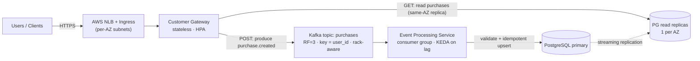

# Purchase Events Platform — Technical Design

> **Status:** Design proposal · **Author:** _(candidate)_ · **Last updated:** 2026-06-15
> **Scope of this document:** design and decision-making only. See [Scope & Approach](#1-scope--approach) for why implementation is intentionally deferred.

---

## Table of Contents

1. [Scope & Approach](#1-scope--approach)
2. [Requirements](#2-requirements)
3. [Architecture Overview](#3-architecture-overview)
4. [Component Design](#4-component-design)
5. [API, Event & Data Contracts](#5-api-event--data-contracts)
6. [Delivery Semantics & Consistency](#6-delivery-semantics--consistency)
7. [Kubernetes Design](#7-kubernetes-design)
8. [Cross-AZ Cost Minimization](#8-cross-az-cost-minimization)
9. [Failure-Domain Design (survive 1 AZ + 1 node)](#9-failure-domain-design-survive-1-az--1-node)
10. [Scalability](#10-scalability)
11. [Observability](#11-observability)
12. [Security](#12-security)
13. [CI/CD — GitHub Actions (bonus)](#13-cicd--github-actions-bonus)
14. [Build / Deploy / Test (intended runbook)](#14-build--deploy--test-intended-runbook)
15. [Proposed Repository Structure](#15-proposed-repository-structure)
16. [Trade-offs Summary](#16-trade-offs-summary)
17. [Decision Log](#17-decision-log)
18. [Risks & Future Work](#18-risks--future-work)

---

## 1. Scope & Approach

The original take-home is scoped at "approximately three days" and asks for a fully
implemented, deployed, and documented system plus a CI/CD pipeline. After reviewing it I
made a deliberate scoping decision and aligned it with the recruiter up front:

> **This deliverable is a technical *design*, time-boxed to ~2 hours, not a running
> implementation.**

Rationale — and why I think this is the right senior call rather than a shortcut:

- **Design is the highest-leverage artifact.** Nearly every evaluation criterion in the
  assignment — system design, Kubernetes decisions, resilience/scalability reasoning,
  observability strategy, and *clarity of trade-offs* — is demonstrable in design without
  spending two days on YAML, Helm charts, and glue code.
- **Respecting scope is itself a senior signal.** Recognizing that an estimate is
  mismatched to the value being tested, surfacing it early, and proposing a bounded
  alternative is exactly the judgment the role requires.
- **The design is implementation-ready.** Every section below is concrete enough to hand
  to an engineer (or to myself) and execute. Where I would build it, I name the specific
  operators, manifests, metrics, and pipeline stages — see
  [§15 Proposed Repository Structure](#15-proposed-repository-structure) and
  [§14 Intended Runbook](#14-build--deploy--test-intended-runbook).

**Target platform:** AWS EKS, 3 Availability Zones, single region.

---

## 2. Requirements

### 2.1 Functional

| # | Requirement |
|---|---|
| F1 | Accept purchase requests from users over HTTP. |
| F2 | Publish each purchase as an event to an asynchronous event stream. |
| F3 | Consume, validate, and persist purchase events. |
| F4 | Return all purchases for a given user. |
| F5 | Persist at minimum: user identifier, username, price, timestamp. |

### 2.2 Non-functional

| # | Requirement | Source |
|---|---|---|
| N1 | Entire system runs on Kubernetes. | assignment |
| N2 | Minimize cross-AZ data-transfer cost between components. | assignment |
| N3 | Remain operational through **1 AZ failure _and_ 1 node failure** (concurrent). | assignment |
| N4 | Components expose health signals for K8s availability decisions. | assignment |
| N5 | Workloads declare explicit resource requests/limits. | assignment |
| N6 | Capacity auto-adjusts with demand; reasoning documented. | assignment |
| N7 | Observability sufficient to debug failures and understand throughput. | assignment |

### 2.3 Assumptions

- Purchases are **write-heavy and append-only** (no in-place edits of a purchase).
- **Ordering matters per user** (a user's events should be processed in submission order);
  global ordering is not required.
- A purchase event is **small** (< 1 KB).
- **Eventual consistency on reads is acceptable** — the write path is asynchronous by
  design (gateway → stream → processor → DB). See [§6](#6-delivery-semantics--consistency).
- Workload is **spiky** (sales/marketing bursts), which is what justifies an event buffer
  and autoscaling rather than synchronous writes.

---

## 3. Architecture Overview



**Write path (async, F1–F3, F5):**
`Client → Gateway → Kafka (purchases) → Processor → Postgres`.
The gateway returns `202 Accepted` as soon as the event is durably written to Kafka. The
stream absorbs bursts and decouples ingest rate from DB write rate.

**Read path (sync, F4):**
`Client → Gateway → Postgres read replica`. Reads are served from a same-AZ read replica
to keep them off the primary and to minimize cross-AZ traffic.

**Why event-driven at all** (vs. the gateway writing straight to the DB): the assignment
explicitly asks for an event stream, but it's also the right shape here — it buffers spiky
purchase traffic, decouples ingest from persistence, lets the two sides scale
independently, and gives us a replayable log for reprocessing and debugging.

---

## 4. Component Design

### 4.1 Customer Gateway

- **Responsibility:** terminate client HTTP, validate request shape, attach an
  idempotency key, **produce** to Kafka (write path), and **read** from Postgres (read
  path). No business logic, no DB writes.
- **Statelessness:** fully stateless → trivially horizontally scalable and a clean target
  for an HPA.
- **Why split read and write here:** the gateway owns both API surfaces but they have
  different scaling and latency profiles. Keeping it one deployment is simpler to operate
  for this size; if read and write volumes diverge sharply we'd split into two
  deployments behind the same Ingress (noted in [§18](#18-risks--future-work)).
- **Implementation note:** Go or Python/FastAPI; idempotent producer
  (`enable.idempotence=true`, `acks=all`) so retries don't duplicate events.

### 4.2 Event Stream — Apache Kafka (via Strimzi)

**Decision: self-hosted Kafka on EKS, managed by the Strimzi operator (KRaft mode, no
ZooKeeper).** Full reasoning and the SQS comparison are in
[ADR-0001](adr/0001-messaging-kafka-vs-sqs.md); the cost mechanics are in
[§8](#8-cross-az-cost-minimization). Summary of why Kafka over SQS *despite* SQS being
cheaper on cross-AZ transfer:

- **Ordering per user** via partitioning on `user_id` (key). SQS Standard is unordered;
  SQS FIFO adds ordering but caps throughput and complicates partition-style scaling.
- **Replay & durability** — the log lets us reprocess after a bug or rebuild the DB. A
  queue deletes on consume.
- **Consumer-lag autoscaling** — partition lag is a first-class, accurate scaling signal
  for the processor (KEDA). See [§10](#10-scalability).
- **"Runs on Kubernetes / operational maturity"** — the assignment rewards operating a
  stateful distributed system on K8s. A managed regional queue sidesteps exactly the skill
  being tested.

Topic `purchases`: **partitions = 12** (room to scale the consumer group),
**replication factor = 3**, **`min.insync.replicas = 2`**, `acks=all`, rack-aware replica
placement (`broker.rack` = AZ). Retention: 7 days (replay window) — tune to cost.

### 4.3 Event Processing Service

- **Responsibility:** consume `purchases`, validate the payload, and **idempotently
  upsert** into Postgres keyed on `event_id`.
- **Consumer group** — one group; partitions distribute across pods, so scaling the
  deployment scales parallel consumption (up to `partitions = 12`).
- **At-least-once + idempotent writes** — Kafka redelivers on failure; the
  `INSERT ... ON CONFLICT (event_id) DO NOTHING` makes reprocessing safe. See
  [§6](#6-delivery-semantics--consistency).
- **Offset commit after DB commit** — commit Kafka offsets only after the row is durable,
  preserving at-least-once and avoiding silent data loss.

### 4.4 Database — PostgreSQL (see [ADR-0002](adr/0002-database-selfhosted-vs-managed.md))

The assignment asked me to compare options, so [ADR-0002](adr/0002-database-selfhosted-vs-managed.md)
weighs **self-hosted Postgres on EKS (CloudNativePG operator)** against **managed RDS
Multi-AZ**. Short version:

| | Self-hosted (CloudNativePG) | Managed (RDS Multi-AZ) |
|---|---|---|
| "Runs on K8s" intent | ✅ in-cluster | ⚠️ external to cluster |
| Reviewer can run it locally | ✅ (kind/minikube) | ❌ needs AWS |
| HA / failover / backups | self-operated (operator automates most) | AWS-managed |
| Cross-AZ read locality | ✅ we place replicas per-AZ | ⚠️ RDS read replicas, less control |
| Operational burden | higher | lower |

**Recommendation:** **CloudNativePG** as the primary design — it keeps the whole system
runnable on a laptop, demonstrates operating stateful workloads on K8s (the point of the
exercise), and gives us direct control over per-AZ replica placement for the read path.
For a real production launch I'd default to **RDS Multi-AZ** to offload HA/backups, and
the application is written to be agnostic to which one is behind the connection string.

Topology: **1 primary + 2 (ideally 3) replicas, one per AZ**, synchronous commit to a
quorum (`ANY 1`) for durability without paying 3× cross-AZ write latency. Sizing rationale
in [§9](#9-failure-domain-design-survive-1-az--1-node).

---

## 5. API, Event & Data Contracts

### 5.1 REST API (Customer Gateway)

```
POST /v1/purchases
  Headers: Idempotency-Key: <uuid>        # optional; gateway generates if absent
  Body:    { "user_id": "u-123", "username": "alice", "price": 49.90, "currency": "USD" }
  201/202: { "event_id": "<uuid>", "status": "accepted" }   # 202 = async accepted

GET /v1/users/{user_id}/purchases?limit=50&cursor=<opaque>
  200: { "items": [ { "event_id", "user_id", "username", "price", "currency",
                      "purchased_at" } ], "next_cursor": "<opaque|null>" }

GET /healthz      # liveness  — process up
GET /readyz       # readiness — Kafka producer + DB reachable
GET /metrics      # Prometheus exposition
```

### 5.2 Event schema (`purchases` topic)

Key = `user_id` (guarantees per-user ordering). Value (versioned JSON or Avro/Schema
Registry in production):

```json
{
  "event_id": "uuid",
  "event_type": "purchase.created",
  "schema_version": 1,
  "user_id": "u-123",
  "username": "alice",
  "price": 49.90,
  "currency": "USD",
  "occurred_at": "2026-06-15T10:00:00Z"
}
```

### 5.3 Database schema

```sql
CREATE TABLE purchases (
  event_id     UUID PRIMARY KEY,          -- idempotency key (dedup on reprocess)
  user_id      TEXT        NOT NULL,
  username     TEXT        NOT NULL,
  price        NUMERIC(12,2) NOT NULL,
  currency     CHAR(3)     NOT NULL DEFAULT 'USD',
  purchased_at TIMESTAMPTZ NOT NULL,      -- business time (occurred_at)
  created_at   TIMESTAMPTZ NOT NULL DEFAULT now()  -- ingest time
);
CREATE INDEX idx_purchases_user_time ON purchases (user_id, purchased_at DESC);
```

`event_id` PK gives free idempotency; the composite index serves the F4 read pattern
(latest-first, paginated, per user).

---

## 6. Delivery Semantics & Consistency

- **Delivery: at-least-once.** Kafka + offset-after-commit can redeliver on failure. We
  make this safe with **idempotent upserts** (`ON CONFLICT (event_id) DO NOTHING`).
  Exactly-once across the Kafka→Postgres boundary is intentionally *not* pursued — it adds
  significant complexity (transactional outbox or Kafka EOS to an external sink) for little
  value when idempotent upserts already produce the same end state.
- **Producer idempotence** on the gateway (`enable.idempotence=true`) prevents duplicate
  events from producer retries; the `Idempotency-Key` → `event_id` ties a client retry to
  the same event.
- **Consistency model: read-your-writes is _not_ guaranteed.** Because persistence is
  asynchronous, a `GET` immediately after a `POST` may not show the purchase yet. This is
  an explicit trade-off for burst absorption and decoupling. Mitigations:
  - The `POST` returns `202` + `event_id` so clients know the write is *accepted*, not yet
    queryable.
  - Typical end-to-end lag is sub-second under normal load; lag is monitored and alerted
    ([§11](#11-observability)).
  - If a strict read-your-writes guarantee were required, we'd add an optional synchronous
    "confirm" path or a status endpoint keyed on `event_id` — noted in
    [§18](#18-risks--future-work).

---

## 7. Kubernetes Design

### 7.1 Cluster topology

- **EKS**, one region, **3 AZs**. Managed node groups (or **Karpenter**) span all 3 AZs.
- Separate node pools: **stateless app** pool (gateway, processor — burstable, spot-friendly)
  and **stateful** pool (Kafka brokers, Postgres — on-demand, with EBS gp3, taints so only
  stateful pods land there).
- Each AZ has its own subnet; the NLB has a node/target in each AZ.

### 7.2 Health signals (N4)

Every workload exposes three distinct probes — conflating them is a common cause of
cascading restarts:

| Probe | Gateway | Processor | Meaning |
|---|---|---|---|
| **startup** | wait for deps | wait for consumer join | don't kill slow starters |
| **liveness** (`/healthz`) | process responsive | event loop alive | restart if deadlocked |
| **readiness** (`/readyz`) | Kafka producer + DB reachable | assigned partitions + DB reachable | pull from Service endpoints when a dep is down |

Readiness gating a dependency is what lets a pod *stay running but stop receiving traffic*
during a transient Kafka/DB blip instead of crash-looping.

### 7.3 Resource management (N5)

- Every container sets **requests and limits**. CPU: set requests honestly, **omit CPU
  limits** on latency-sensitive services to avoid throttling (or set generously); memory:
  **request == limit** to land in the **Guaranteed** QoS class and avoid OOM eviction of
  stateful pods.
- Kafka and Postgres pods are **Guaranteed** QoS; app pods are **Burstable**.
- Initial figures come from load testing (k6) and are tuned via VPA in *recommend* mode —
  see [§10](#10-scalability).

### 7.4 Scheduling, spread & disruption

- **`topologySpreadConstraints`** on every workload: `maxSkew: 1` over both
  `topology.kubernetes.io/zone` **and** `kubernetes.io/hostname` → replicas spread evenly
  across AZs and across nodes. This is what makes N3 achievable.
- **PodDisruptionBudgets** on all multi-replica workloads (`minAvailable` sized so an AZ
  drain can't take quorum) to protect against *voluntary* disruptions (node upgrades).
- **Anti-affinity** so no two Kafka brokers (or two Postgres instances) share a node.

---

## 8. Cross-AZ Cost Minimization

This is the requirement most people hand-wave, so it gets its own section. Full record in
[ADR-0003](adr/0003-cross-az-cost-minimization.md).

**The cost mechanic.** On AWS, in-region **cross-AZ EC2↔EC2** traffic costs **$0.01/GB in
each direction** (~$0.02/GB round trip). Same-AZ traffic is free. So "minimize cross-AZ"
= "keep each hop inside one AZ wherever correctness allows."

**Honest framing of Kafka vs SQS on _this_ axis** (and the part worth getting right in the
interview):

- **SQS is actually the cheaper option for the messaging hop.** SQS is a regional, managed
  service that hides AZs; in-region EC2↔SQS data transfer is **not billed as cross-AZ**. So
  with SQS the messaging transport has *no* cross-AZ data-transfer charge — you don't need
  AZ-aware routing because there are no AZs to route around. We still choose Kafka, on the
  functional grounds in [§4.2](#42-event-stream--apache-kafka-via-strimzi) /
  [ADR-0001](adr/0001-messaging-kafka-vs-sqs.md) — **not** because it's cheaper.
- **Self-hosted Kafka pays real cross-AZ cost** and we engineer to minimize it:
  - **Replication is unavoidably cross-AZ.** RF=3 with one replica per AZ is *required* to
    survive an AZ loss (N3), and that replication traffic crosses AZs by definition. This
    is a correctness cost we accept.
  - **Consumer reads:** by default consumers fetch from the partition **leader**, often in
    another AZ. We enable **rack-aware follower fetching (KIP-392,
    `RackAwareReplicaSelector`)** so each consumer reads from a **same-AZ replica** —
    eliminating cross-AZ *read* traffic, the largest variable cost at scale.
  - **Producer writes** must go to the leader (can't be made same-AZ in general); this is a
    smaller, bounded cost than fan-out reads.

**The synchronous hops** (the literal "frontend↔backend" in the requirement):

- **Client → Gateway → read replica / Processor → primary:** enable **Topology Aware
  Routing** — `Service.spec.trafficDistribution: PreferClose` (K8s ≥1.31; older clusters
  use the `service.kubernetes.io/topology-mode: Auto` annotation). EndpointSlices then
  prefer same-AZ endpoints, so a gateway pod talks to a same-AZ read replica and a
  processor talks to a same-AZ Kafka broker / DB endpoint when one exists.
- **Read path locality:** place **one Postgres read replica per AZ**; the gateway's read
  queries resolve to the local replica via topology-aware routing. Writes still go to the
  single primary (one unavoidable cross-AZ hop for 2/3 of pods).

**Net:** cross-AZ spend is reduced to the *irreducible* minimum — replication (required for
durability) and primary writes (required for a single source of truth) — while all
high-volume read/consume traffic is kept same-AZ.

---

## 9. Failure-Domain Design (survive 1 AZ + 1 node)

N3 is the sharpest constraint: stay operational through an **AZ loss _and_ a node loss at
the same time**. Worst case in a 3-AZ cluster = lose all of one AZ's capacity **plus** one
node in a *surviving* AZ.

### 9.1 Stateless services (gateway, processor)

Spread across 3 AZs with `topologySpreadConstraints`. Size replicas so that after losing
⌈N/3⌉ (one AZ) **+ 1** (a node), the survivors still serve peak load.

> Example: peak needs **4** healthy replicas. Run **N = 9** (3 per AZ). Lose 1 AZ (−3) and
> 1 node (−1) → **5 healthy ≥ 4**. ✅ HPA `minReplicas` is floored at this safe number.

### 9.2 Kafka

| Concern | Design | AZ+node outcome |
|---|---|---|
| Brokers | **6 brokers, 2 per AZ**, partitions RF=3 **one replica per AZ** (rack-aware) | Lose 1 AZ (−2 brokers) → each partition keeps 2 in-sync replicas (other 2 AZs); `min.insync.replicas=2` still writable. Lose 1 more node → that AZ still has its 2nd broker holding the replica → still ≥2 ISR. ✅ |
| Durability | `acks=all`, `min.insync.replicas=2` | A write is acked only when on ≥2 AZs → an AZ loss can't lose acked data. |
| Control plane (KRaft) | dedicated controller quorum | **Nuance:** 3 controllers tolerate 1 failure; to strictly survive AZ+node concurrently the quorum must be sized/placed so no single AZ holds enough controllers to break quorum when combined with one more failure. I'd run **5 controllers with zone spread** and validate placement, or accept that MSK manages this for us. *Calling this edge out explicitly rather than claiming it for free.* |

### 9.3 PostgreSQL

- **1 primary + 3 replicas across 3 AZs** (4 instances). Lose 1 AZ (−1) and 1 node (−1) →
  **2 instances survive** including at least one promotable replica → CloudNativePG / Patroni
  performs automated failover. With only 3 instances total you'd survive AZ+node but with
  **zero** redundancy left, so the 4-instance layout is what keeps HA *through* the event.
- **Synchronous commit quorum `ANY 1`** — a commit waits for at least one replica in another
  AZ, so failover never loses an acked transaction, without paying full 3-replica sync
  latency.

### 9.4 Why this satisfies N3

Every stateful quorum keeps a majority and every stateless tier keeps enough capacity after
the worst-case `AZ + node` loss. PDBs prevent *voluntary* operations (node upgrades) from
stacking on top of an involuntary failure to breach these margins.

---

## 10. Scalability (N6)

Different tiers get different signals — using the *right* signal per tier is the core
reasoning here.

| Tier | Mechanism | Signal & why |
|---|---|---|
| **Gateway** | **HPA** | CPU + **requests-per-second** (via Prometheus Adapter). Stateless and CPU/connection-bound, so CPU/RPS is the honest signal. |
| **Processor** | **KEDA** (Kafka scaler) | **Consumer lag** (offset lag per partition). CPU lags reality — lag *is* the backlog, so we scale on the thing we actually care about. Capped at `partitions = 12` (extra pods past partition count idle). |
| **Cluster nodes** | **Karpenter** | Provisions/consolidates nodes in the right AZ as pods go pending; AZ-aware so it doesn't fight topology spread. |
| **Kafka** | manual / planned | Partition count is the scaling lever; add partitions ahead of demand (repartitioning is disruptive — capacity-plan it). |
| **Postgres** | read replicas + (later) PgBouncer | Reads scale horizontally on replicas; writes are single-primary (acceptable — purchases are small, append-only). Sharding is future work if write volume demands it. |

**Why KEDA-on-lag for the processor is the headline choice:** the whole point of the event
stream is to absorb bursts. CPU-based autoscaling reacts *after* CPU saturates, by which
point lag is already growing. Scaling directly on lag means we add consumers as the backlog
forms and scale to zero-ish when it drains — the signal and the SLO (end-to-end latency)
are the same quantity. KEDA also lets the processor **scale to a low floor** during quiet
periods to save cost, while `minReplicas` keeps enough for N3.

`HPA`/`KEDA` `minReplicas` are floored at the [§9.1](#91-stateless-services-gateway-processor)
safe number so autoscaling never undercuts resilience. Scale-down uses a stabilization
window to avoid flapping.

---

## 11. Observability (N7)

**Metrics — Prometheus + Grafana.** Golden signals per service plus domain metrics:

- **Gateway (RED):** request rate, error rate, p50/p95/p99 latency; produce success/failure.
- **Processor:** events processed/sec (throughput), processing latency, DLQ count, **DB
  upsert conflict rate** (dedup visibility).
- **Kafka:** **consumer-group lag per partition** (the key health/throughput signal),
  under-replicated partitions, ISR shrink events, broker disk.
- **Postgres:** TPS, replication lag, connections, slow queries.
- **End-to-end lag:** `occurred_at` → `created_at` histogram = the user-visible freshness
  SLI behind the eventual-consistency trade-off in [§6](#6-delivery-semantics--consistency).

**Logs — structured JSON**, shipped to Loki (or CloudWatch), correlated by `event_id` and
trace ID so a single purchase is traceable gateway → Kafka → processor → DB.

**Tracing — OpenTelemetry.** The tricky part is the **async boundary**: inject W3C
trace-context into Kafka **message headers** at produce time and extract it in the consumer
so one trace spans the broker. Without this, traces break at the queue.

**Alerting / SLOs (examples):**

- Consumer lag > threshold for N min → processor isn't keeping up (page).
- End-to-end lag p99 > SLO → freshness breach.
- Under-replicated partitions > 0 → durability risk.
- Gateway 5xx rate / DB replication lag → standard golden-signal alerts.

This set directly answers the assignment's "debug failures **and** understand throughput":
lag + RED + end-to-end-lag cover throughput; structured logs + traces correlated by
`event_id` cover debugging.

---

## 12. Security

- **Secrets:** External Secrets Operator → AWS Secrets Manager; **IRSA** (IAM Roles for
  Service Accounts) so pods get scoped AWS perms with no static keys.
- **Network:** default-deny **NetworkPolicies**; only gateway→Kafka, processor→Kafka,
  processor→DB, gateway→DB-replica are allowed. mTLS between Kafka clients and brokers
  (Strimzi issues certs).
- **Supply chain:** image scanning (Trivy) and SBOM in CI; pinned digests; non-root,
  read-only-rootfs containers.
- **Data:** TLS in transit; EBS encryption at rest for Kafka/Postgres volumes.

---

## 13. CI/CD — GitHub Actions (bonus)

Two workflows, OIDC-federated into AWS (no long-lived keys):

**`ci.yaml` (on PR):** validate → fast feedback, no deploy.
`lint (golangci-lint, hadolint) · unit tests · build images · Trivy scan ·
helm lint / kustomize build · kubeconform manifest validation · kind smoke test`
(spin up kind, deploy, POST a purchase, assert it's queryable).

**`cd.yaml` (on merge to `main` / tag):** build & push images to ECR (digest-pinned) →
`helm upgrade --install` (or Argo CD sync) to EKS → post-deploy smoke test → automatic
rollback on failure.

**How a reviewer uses it:** open a PR → `ci.yaml` runs and must go green; merge to `main`
(or push a `v*` tag) → `cd.yaml` deploys to the cluster. Triggers, required secrets/OIDC
role, and the manual `workflow_dispatch` escape hatch would be documented in the repo
README. Progressive delivery (canary via Argo Rollouts) is the natural next step.

---

## 14. Build / Deploy / Test (intended runbook)

What the README *would* contain so "a reviewer can run the system":

```bash
# 1. Local cluster
kind create cluster --config deploy/kind/kind-3az.yaml   # 3 nodes labeled as fake AZs

# 2. Operators
helm install strimzi strimzi/strimzi-kafka-operator -n kafka --create-namespace
helm install cnpg cnpg/cloudnative-pg -n cnpg --create-namespace
helm install keda kedacore/keda -n keda --create-namespace

# 3. Platform + app (Helm umbrella or kustomize overlay)
helm install purchases ./deploy/helm/purchases -n app --create-namespace

# 4. Smoke test
curl -X POST localhost:8080/v1/purchases \
  -d '{"user_id":"u-1","username":"alice","price":49.9,"currency":"USD"}'
curl localhost:8080/v1/users/u-1/purchases     # eventually shows the purchase

# 5. Load / resilience
k6 run test/load.js
kubectl drain <node>      # observe continued availability (N3)
```

`make up` / `make test` / `make load` would wrap these. On EKS the only delta is real AZ
labels and the NLB/Ingress.

---

## 15. Proposed Repository Structure

```
.
├── README.md                      # what/why, scope decision, quickstart
├── docs/
│   ├── DESIGN.md                  # this document
│   └── adr/                       # architecture decision records
│       ├── 0001-messaging-kafka-vs-sqs.md
│       ├── 0002-database-selfhosted-vs-managed.md
│       └── 0003-cross-az-cost-minimization.md
├── services/
│   ├── gateway/                   # HTTP API: produce + read
│   └── processor/                 # Kafka consumer → Postgres upsert
├── deploy/
│   ├── helm/purchases/            # umbrella chart (app + topic + DB cluster)
│   ├── kustomize/{base,overlays}/ # dev / prod overlays
│   └── kind/kind-3az.yaml         # local 3-"AZ" cluster
├── test/
│   ├── load.js                    # k6 burst test
│   └── e2e/                       # POST→GET eventual-consistency assertion
└── .github/workflows/
    ├── ci.yaml
    └── cd.yaml
```

---

## 16. Trade-offs Summary

| Decision | Chosen | Alternative | Why / cost accepted |
|---|---|---|---|
| Messaging | **Kafka (Strimzi)** | SQS / NATS | Ordering, replay, lag-autoscaling, "runs on K8s". Accept higher ops + cross-AZ replication cost. |
| Cross-AZ reads | **Rack-aware fetch + Topology Aware Routing** | Default leader reads | Keeps high-volume reads same-AZ; replication still cross-AZ (required for N3). |
| Database | **CloudNativePG** (design) / RDS (prod) | RDS only | Reviewer-runnable + demonstrates stateful-on-K8s; RDS for lower prod ops. |
| Delivery | **At-least-once + idempotent upsert** | Exactly-once | Same end state, far less complexity. |
| Consistency | **Eventual (async write)** | Sync write | Burst absorption + decoupling; no read-your-writes. |
| Processor scaling | **KEDA on consumer lag** | HPA on CPU | Lag is the backlog and the SLI; CPU reacts too late. |
| Failover sizing | **6 Kafka brokers / 4 PG instances** | 3 / 3 | Retains HA *through* a concurrent AZ+node loss, not just survives it. |

## 17. Decision Log

- [ADR-0001 — Messaging: Kafka vs SQS](adr/0001-messaging-kafka-vs-sqs.md)
- [ADR-0002 — Database: self-hosted vs managed](adr/0002-database-selfhosted-vs-managed.md)
- [ADR-0003 — Cross-AZ cost minimization strategy](adr/0003-cross-az-cost-minimization.md)

## 18. Risks & Future Work

- **Split gateway** into read and write deployments if the two volumes diverge.
- **Schema Registry** (Avro/Protobuf) for event-schema evolution instead of versioned JSON.
- **Dead-letter topic** + redrive for poison events (sketched, not detailed).
- **Read-your-writes** option via an `event_id` status endpoint if a client needs it.
- **Write-path scaling** beyond a single Postgres primary (partition/shard by `user_id`,
  or move to a distributed store) if purchase write volume outgrows one primary.
- **KRaft controller quorum** placement validated against the concurrent AZ+node case
  ([§9.2](#92-kafka)).
- **Progressive delivery** (Argo Rollouts canary) in the CD pipeline.
```
